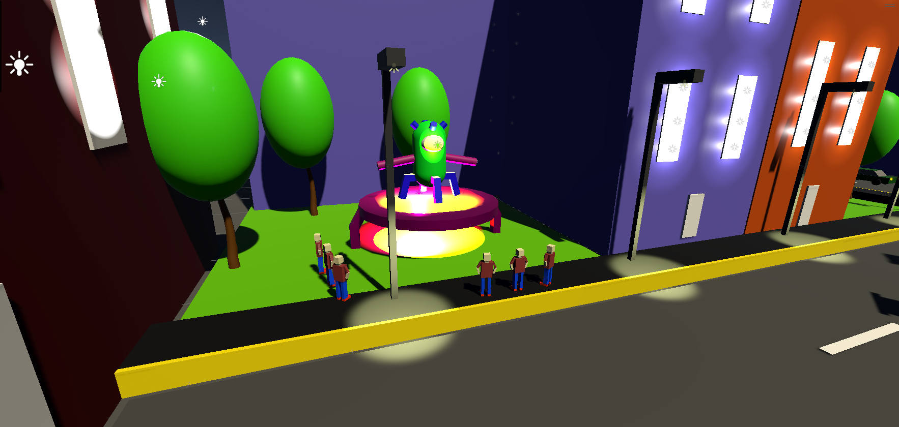
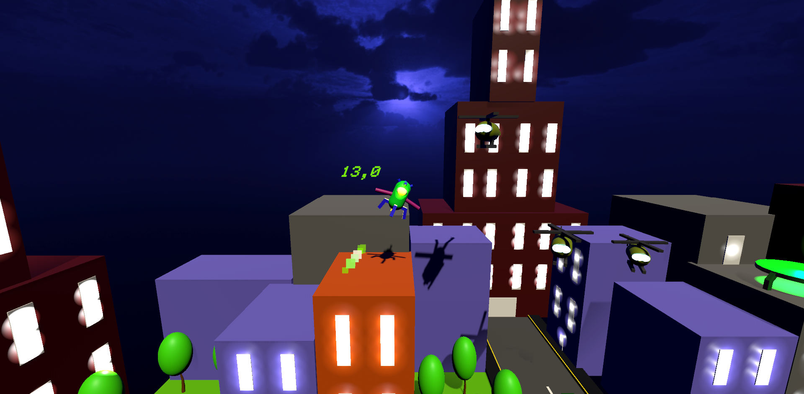
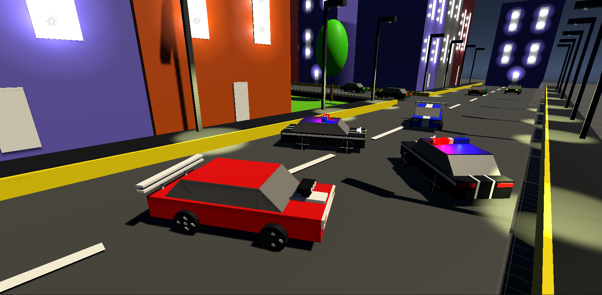
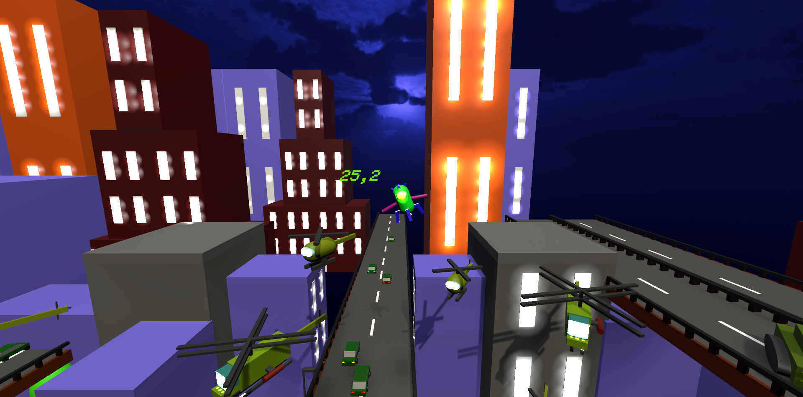
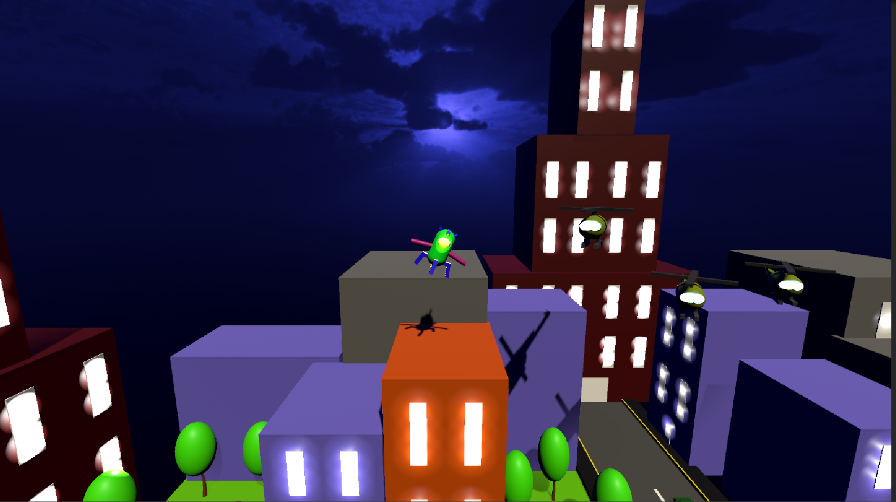
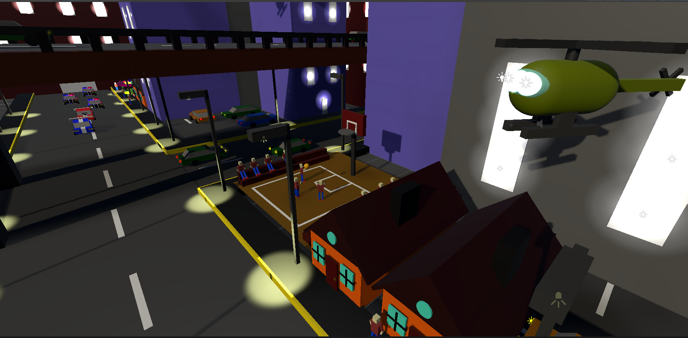
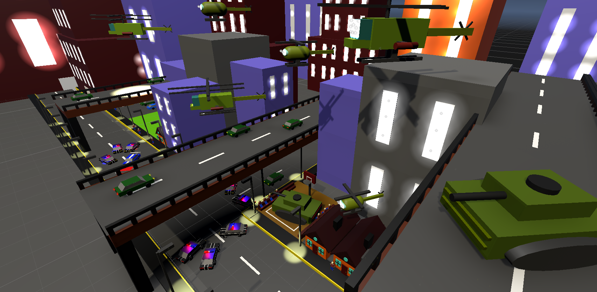

# Escape From Humans

Basic mini 3D Game

## Theme

You came to invade the world, but you realized that people are crazier than you. You are trying to escape from the world, but the military is after you.

I made a simple damage control system. If you hit one of the Rocket side boosters, they will not bursting.
I added police and helicopter sounds. Increases or decreases the volume according to the distance.

## Play

[Play Escape From Humans](https://sharemygame.com/@mustafaHTP/escape-from-humans)

If you have windows installed machine, you can try Escape From Humans on your desktop, download [here](https://github.com/mustafaHTP/escape-from-humans/releases/tag/Latest).

You can also watch the gameplay [here](https://youtu.be/XX40I8pAwGE).

## Controls

Rotate the rocket - **Left arrow**, **Right arrow**, **A**,**D**, **Gamepad/Xbox Controller Left Stick**

Boost - **Space**, **Gamepad - Button South**, **Xbox Controller - A**

### Debug Keys

R → Reset Level

L → Load Next Level

C → Disable Collision

1,2,3 → Set Level

## Screenshots

---

---

---

---

---

---

